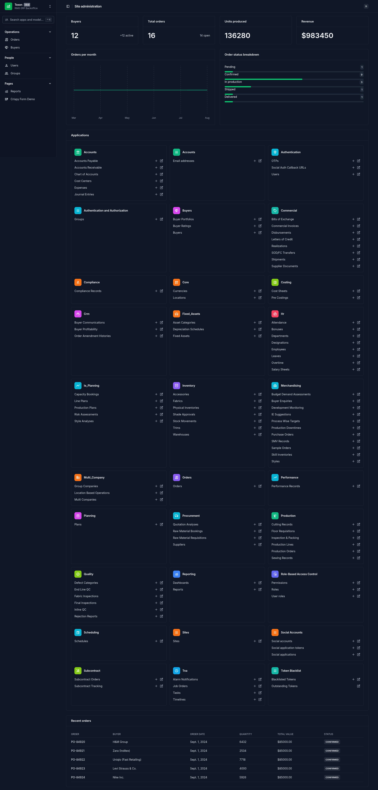

# Texon - RMG ERP System

A comprehensive Enterprise Resource Planning (ERP) system tailored for the Ready-Made Garment (RMG) industry. This system streamlines production, inventory, order management, and various operational workflows specific to garment manufacturing.

## 📸 Screenshots admin panel



## 🚀 Getting Started

Follow these instructions to get a copy of the project up and running on your local machine.

### Prerequisites

Ensure you have the following installed:
- [Python 3.8+](https://www.python.org/downloads/)
- [PostgreSQL](https://www.postgresql.org/download/) or [MySQL](https://dev.mysql.com/downloads/)
- [Node.js](https://nodejs.org/) and [npm](https://www.npmjs.com/)
- [uv](https://github.com/astral-sh/uv) (For Python dependency management)
- [Docker](https://www.docker.com/) (Optional, for containerized deployment)

### Installation

#### 1. Clone the repository
```bash
git clone https://github.com/Afzal20/texon
cd texon/backend
```

#### 2. Create and activate a virtual environment
```bash
uv venv
source .venv/bin/activate  # On Windows use: .venv\Scripts\activate
```

#### 3. Install Python dependencies
```bash
uv sync
```

#### 4. Configure Environment Variables
Create a `.env` file in the `backend/` directory with the following variables:

```env
# Database Configuration
DB_NAME=texon
DB_USER=your_db_user
DB_PASSWORD=your_db_password
DB_HOST=[IP_ADDRESS]
DB_PORT=5432

# Django Settings
SECRET_KEY=your_secret_key_here
DEBUG=True
ALLOWED_HOSTS=*

# Email Configuration (Optional)
EMAIL_BACKEND=django.core.mail.backends.smtp.EmailBackend
EMAIL_HOST=smtp.example.com
EMAIL_PORT=587
EMAIL_USE_TLS=True
EMAIL_HOST_USER=your_email@example.com
EMAIL_HOST_PASSWORD=your_email_password
```

#### 5. Run Database Migrations
```bash
uv run manage.py migrate
```

#### 6. Collect Static Files
```bash
uv run manage.py collectstatic
```

#### 7. Create Superuser (Optional)
```bash
uv run manage.py createsuperuser
```

#### 8. Start Development Server
```bash
uv run manage.py runserver
```

## 🏗️ Project Structure

```
backend/
├── config/              # Django project settings and config
├── authentication/      # User authentication and profile management
├── operations/          # Core operations (Orders, Purchases, Sales, Production)
├── inventory/           # Inventory and stock management
├── master_data/         # Static and master data (Colors, Sizes, Fabrics, etc.)
├── reports/             # Report generation
├── settings/            # Settings modules
└── static/              # Static files
```

## 🛠️ Tech Stack

### Backend
- **Framework**: Django 6.0
- **API**: Django REST Framework
- **Database**: PostgreSQL / MySQL
- **Authentication**: JWT, Social Auth
- **Documentation**: drf-spectacular (OpenAPI/Swagger)
- **Validation**: Pydantic (via `pydantic-settings`)
- **Deployment**: Gunicorn, Nginx (optional)

### Frontend
- **Framework**: Django Templates + HTMX
- **Styling**: Tailwind CSS (compiled via Django)
- **UI Kit**: Unfold Admin (Custom Admin Interface)

## 🧪 Testing

Run the test suite using pytest:
```bash
uv run pytest
```

## 🚀 Deployment

### Docker Deployment

For a production deployment, use the provided Docker configuration.

1. **Build and Run Containers**:
   ```bash
   docker-compose -f docker-compose.yml up -d --build
   ```

2. **Access the Application**:
   - **Frontend**: http://localhost:8000
   - **Admin**: http://localhost:8000/admin
   - **API Docs**: http://localhost:8000/swagger-ui/

3. **Stop Containers**:
   ```bash
   docker-compose -f docker-compose.yml down
   ```

### Manual Production Setup

If deploying manually:
1. Install Gunicorn: `pip install gunicorn`
2. Configure Nginx as a reverse proxy
3. Set up systemd service for Gunicorn
4. Configure SSL/TLS certificates

## 📝 License

This project is licensed under the MIT License - see the [LICENSE](LICENSE) file for details.

## 🤝 Contributing

Contributions are welcome! Please feel free to submit a Pull Request.


# Texon Setup Guide (uv only)

Setup guide for **Arch Linux**, **Debian/Ubuntu** and **Windows** using [uv](https://docs.astral.sh/uv/) as the only Python tool. Required services: **PostgreSQL** and **Redis**.

> Repo: https://github.com/Afzal20/texon

---

## 1. Install uv

uv is the only Python tool you need. It downloads and manages Python itself (no manual Python install required).

### Arch Linux
```bash
sudo pacman -S uv
```

### Debian / Ubuntu
```bash
curl -LsSf https://astral.sh/uv/install.sh | sh
# restart your shell, then verify
uv --version
```

### Windows (PowerShell)
```powershell
winget install astral-sh.uv
# or
powershell -ExecutionPolicy ByPass -c "irm https://astral.sh/uv/install.ps1 | iex"
```

---

## 2. Install PostgreSQL and Redis

### Arch Linux
```bash
sudo pacman -S postgresql redis

# initialize the PostgreSQL data directory (required on Arch)
sudo -u postgres initdb -D /var/lib/postgres/data

# enable and start services
sudo systemctl enable --now postgresql
sudo systemctl enable --now redis
```

### Debian / Ubuntu
```bash
sudo apt update
sudo apt install -y postgresql redis-server

sudo systemctl enable --now postgresql
sudo systemctl enable --now redis-server
```

### Windows (PowerShell)
```powershell
winget install PostgreSQL.PostgreSQL.16
winget install Redis.Redis
```

After installation, start the services (they normally start automatically):
- **PostgreSQL**: Start "PostgreSQL 16" service in Services (services.msc)
- **Redis**: Start "Redis" service in Services (services.msc)

---

## 3. Clone the repository

```bash
git clone https://github.com/Afzal20/texon.git
cd texon/backend
```

---

## 4. Set up the Python environment (uv only)

```bash
# install the Python version required by the project (3.14)
uv python install 3.14

# create the virtual environment and install all dependencies from uv.lock
uv sync
```

`uv sync` creates `.venv` and installs every dependency automatically. No pip, no manual venv.

---

## 5. Create the PostgreSQL database and user

### Linux (Arch / Debian)
```bash
sudo -u postgres psql
```
Inside the psql prompt:
```sql
CREATE USER texon WITH PASSWORD 'texon_password';
CREATE DATABASE texon OWNER texon;
ALTER USER texon CREATEDB;
\q
```

### Windows (PowerShell)
```powershell
# connect as the postgres superuser (password was set during PostgreSQL install)
psql -U postgres
```
Inside the psql prompt, run the same SQL as above.

---

## 6. Configure environment variables

Create a `.env` file inside `backend/`:

```env
# Django
DJANGO_SECRET_KEY=your_secret_key_here
DJANGO_DEBUG=True
ALLOWED_HOSTS=*

# PostgreSQL
DB_NAME=texon
DB_USER=texon
DB_PASSWORD=texon_password
DB_HOST=127.0.0.1
DB_PORT=5432

# Redis (used by Channels)
REDIS_URL=redis://127.0.0.1:6379/0

# Email (optional)
EMAIL_BACKEND=django.core.mail.backends.console.EmailBackend
```

**Switch the database from SQLite to PostgreSQL** — edit `backend/config/settings.py`, replace the `DATABASES` block (line ~139):

```python
DATABASES = {
    'default': {
        'ENGINE': 'django.db.backends.postgresql',
        'NAME': config('DB_NAME', default='texon'),
        'USER': config('DB_USER', default='texon'),
        'PASSWORD': config('DB_PASSWORD', default=''),
        'HOST': config('DB_HOST', default='127.0.0.1'),
        'PORT': config('DB_PORT', default='5432', cast=int),
    }
}
```

**Use Redis for Channels** — in the same file, replace the `CHANNEL_LAYERS` block (line ~362):

```python
CHANNEL_LAYERS = {
    'default': {
        'BACKEND': 'channels_redis.core.RedisChannelLayer',
        'CONFIG': {
            'hosts': [config('REDIS_URL', default='redis://127.0.0.1:6379/0')],
        },
    },
}
```

Then add the Redis channels backend (uv only):

```bash
uv add channels-redis
```

---

## 7. Run migrations and start the server

```bash
# apply database migrations
uv run manage.py migrate

# (optional) collect static files
uv run manage.py collectstatic --noinput

# create an admin user
uv run manage.py createsuperuser

# start the development server
uv run manage.py runserver
```

Open:
- **App**: http://localhost:8000
- **Admin**: http://localhost:8000/admin
- **API Docs (Swagger)**: http://localhost:8000/swagger-ui/

---

## 8. Run tests (optional)

```bash
uv run pytest
```

---

## Troubleshooting

| Problem | Fix |
|---|---|
| `uv` not found after install | Restart your shell / terminal |
| `connection refused` for PostgreSQL | Ensure the service is running (`systemctl status postgresql` / Services on Windows) |
| `initdb` error on Arch | Run `sudo -u postgres initdb -D /var/lib/postgres/data` first |
| Redis not running | `systemctl status redis` (Linux) or the "Redis" Windows service |
| Python version error | `uv python install 3.14` then `uv sync` again |